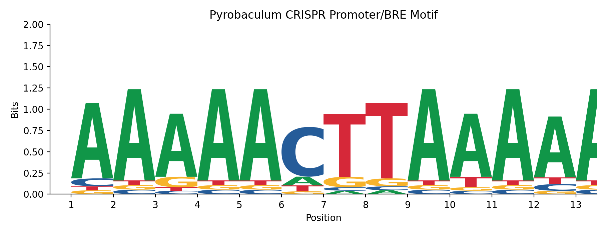

# Randomized Motif Search — CRISPR Promoter Element Discovery

A from-scratch implementation of Randomized Motif Search (Compeau & Pevzner,
*Bioinformatics Algorithms*, p. 93), applied to a real regulatory biology
question: locating the conserved promoter motif upstream of CRISPR arrays
in *Pyrobaculum* (archaeal) genomes, plus a sequence logo visualization of
the result.

## Background

CRISPR arrays are found in most archaeal species and many bacterial
species. They're encoded in chromosomal DNA as direct repeat (DR) sequences
that flank spacer sequences, which provide sequence-specific immunity
against invading plasmids, viruses, and other foreign nucleic acid. Arrays
can be as short as 1–2 spacers or contain hundreds. CRISPR systems fall
into three main classes — type I, II, and III — classified by the specific
Cas genes that encode their associated protein machinery. Archaea are known
to carry type I and III systems; type II (the *Streptococcus pyogenes* /
Cas9 system) has so far only been observed in bacteria.

Transcription of a CRISPR array's RNA is thought to be initiated by a
promoter element located upstream of the array, associated with a B
recognition element (BRE). The resulting transcript is later cleaved into
individual spacers and loaded into Cas protein complexes for targeted
interference.

This project asks: **what does that promoter motif look like, and where
does it sit relative to the array?** The exact sequence isn't known in
advance — only that it's roughly 13 nucleotides long, and that in tightly
gene-packed *Pyrobaculum* genomes, it should be findable within roughly the
50 bases immediately upstream of each array. We also have to assume the
motif tolerates some mutation across different array instances and
different species, rather than being perfectly conserved — exactly the
setting Randomized Motif Search is designed for: finding a weakly
conserved, imperfect motif across a set of sequences without knowing its
exact form in advance.

## The algorithm

Randomized Motif Search solves motif-finding by local search with random
restarts, rather than brute-force enumeration (which becomes intractable
once sequences and motif lengths grow):

1. **Random seed** — pick one random *k*-mer from each input sequence as
   an initial guess at the motif.
2. **Build a profile** — from the current guess, build a position-weight
   matrix (probability of each base at each position), using Laplace
   pseudocounts (+1 per base) so that a single unmutated occurrence of a
   base doesn't drive a position's probability to a hard 0 or 1. This
   matters here specifically because we expect the true motif to be
   imperfectly conserved across arrays and species, not identical in every
   instance.
3. **Re-scan** — for each sequence, find the *k*-mer most probable under
   that profile (rather than keeping the original random guess).
4. **Score and iterate** — score the new motif set using Shannon entropy
   per profile column, summed across all positions (lower = more
   conserved). If it improved on the previous best, keep iterating from
   there; if not, stop — this is now a local optimum.
5. **Random restart** — a single run converges to a local optimum, not
   necessarily the best possible motif. So the whole process (steps 1–4)
   is repeated many times from fresh random seeds, and the best (lowest
   entropy) result found across all restarts is kept.

The output is the consensus sequence of the best motif set found across
all restarts, its entropy score, and (optionally) the actual recovered
motif instance from each input sequence, which can be visualized as a
sequence logo.

## Usage

Two scripts, run in sequence:

**1. Search for the motif:**
```bash
python3 randomizedMotifSearch.py -i=100000 -k=13 -m=motifs.txt < upstream_sequences.fa > result.fa
```
- `-i` — number of random-restart iterations. Higher values reduce the risk
  of reporting a local optimum instead of the true conserved motif, at the
  cost of runtime.
- `-k` — motif length to search for (set to 13 based on the expected
  promoter/BRE length; adjustable to explore neighboring lengths).
- `-m` — (optional) writes the actual recovered motif instance from each
  input sequence to a plain text file, one per line. Needed as input to
  the logo script below.

Output (`result.fa`, printed to stdout):
```
>consensus
aaaaacttaaaaa
score=11.9022
```

**2. Visualize the result as a sequence logo:**
```bash
python3 motifLogo.py -o=logo.png -t "Pyrobaculum CRISPR Promoter/BRE Motif" < motifs.txt
```
- `-o` — output image path for the logo.
- `-t` — title for the plot.

Accepts either the plain-text `motifs.txt` from step 1, or a FASTA-formatted
file of motif instances.

## Results

Run against 19 upstream sequences (50 bp each, immediately upstream of a
CRISPR array) pooled across three *Pyrobaculum* species — *P. aerophilum*,
*P. calidifontis*, and *P. islandicum* — the search consistently converges
(across independent runs and iteration counts) on the same 13 bp consensus:

```
aaaaacttaaaaa
```

16 of the 19 sequences carry a near-exact copy of this motif (≤1 mismatch),
and in the majority of those, it sits at a strikingly consistent position:
**~25 bp upstream of the array start**, with a tight spread of 25–29 bp
across all matches. That combination — an AT-rich element of the expected
length, conserved across three related species, sitting at a fixed distance
upstream of the array — is consistent with the expected profile of an
archaeal promoter + BRE element, rather than a coincidental repeated
sequence.

The 3 sequences that don't match well are plausible secondary array copies:
loci with multiple CRISPR arrays in close proximity likely don't each need
an independent promoter, since a single upstream transcript can potentially
cover more than one downstream array.



## Files

- `randomizedMotifSearch.py` — the search algorithm, CLI wrapper, and FASTA
  reader, encapsulated as classes (`RandomizedMotifSearch`, `FastaReader`,
  `CommandLine`).
- `motifLogo.py` — builds a sequence logo (information-content-scaled
  stacked letters, in bits) from a set of motif instances, using the same
  profile-construction logic as the search script.
- `pyrobaculum_upstream_sequences.fa` — the 19 real upstream sequences (3
  *Pyrobaculum* species pooled) used to generate the results above.
- `example_output_logo.png` — the sequence logo generated from this dataset.

## Notes on the implementation

- Profile construction uses Laplace pseudocounts (+1 per base), needed
  because the true motif is expected to tolerate mutation across arrays
  and species, not be identical in every instance.
- Scoring uses Shannon entropy per profile column, summed across all
  positions, rather than a simple consensus/Hamming-distance-based score.
- A single call to Randomized Motif Search converges to a local optimum
  and is not guaranteed to find the globally best-conserved motif — hence
  the `-i` random-restart loop.
- The sequence logo scales each letter's height by
  `frequency × information_content` at that position, where information
  content is `log2(4) − entropy` (max 2 bits for a fully conserved
  position in a 4-letter alphabet) — the same convention used by standard
  tools like WebLogo.

## Reference

Compeau, P. & Pevzner, P. *Bioinformatics Algorithms: An Active Learning
Approach*, Ch. 2 (Randomized Motif Search, p. 93).
